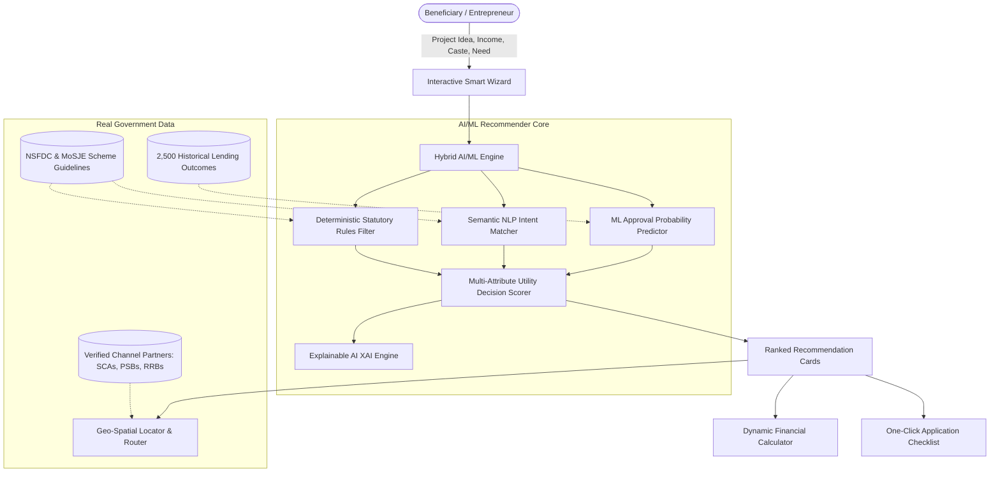

# Scheme Sathi
### AI-Driven Scheme Matching for Marginalized Entrepreneurs
**Smart India Hackathon (SIH 2024 / 2025) • Problem Statement ID: 26092**  
**Ministry / Department:** Ministry of Social Justice and Empowerment (MoSJE)  
**Organization:** National Scheduled Castes Finance and Development Corporation (NSFDC)  
**Theme:** Smart Automation / Software  

---

## 1. Problem Overview & Challenge

To promote socio-economic empowerment of the Scheduled Caste (SC) population, the Government of India provides concessional credit assistance and educational loans covering up to 90%–95% of project costs at 4.0% to 8.0% annual interest rates (annual family income up to ₹3.00–₹5.00 Lakhs).

However, direct loan applications are not entertained; funds are routed through a **Channel Finance System** comprising over 100 Channel Partners (State Channelizing Agencies - SCAs, Public Sector Banks - PSBs, Regional Rural Banks - RRBs, and NBFC-MFIs). 

### Key Difficulties Faced by Beneficiaries:
1. **Lack of Scheme Awareness**: Citizens struggle to choose between Micro Credit (up to ₹1.40L), Term Loans (up to ₹50L), Green Mobility, or Educational Loans.
2. **Offline Confusion & Misrouted Applications**: Submitting applications to wrong partners or agencies with exhausted quotas or high NPAs causes severe disbursement delays.
3. **Complex Repayment Terms**: Lack of transparency on moratorium grace periods (3 to 12 months) and EMI amortization schedules.

---

## 2. The Solution: Scheme Sathi

**Scheme Sathi** is an intelligent, multi-lingual digital platform featuring a **production-grade AI/ML Scheme Recommendation & Scoring Engine** integrated with a dynamic **Financial Calculator** and **Geo-Spatial Partner Locator**.



---

## 3. AI/ML Architecture (Core Focus)

The core assigned module is the **AI/ML Scheme Recommender & Loan Evaluator**, engineered using a hybrid pipeline:

1. **Deterministic Statutory Filter (Gatekeeper)**:
   - Enforces official MoSJE/NSFDC income ceilings (e.g. ₹3,00,000/yr), caste eligibility (SC, Safai Karamchari/Manual Scavenger dependents), and scheme loan limits.
   - Evaluates affirmative action criteria (e.g., Mahila Samriddhi Yojana reserved exclusively for women entrepreneurs).

2. **Semantic NLP Intent Matcher**:
   - Beneficiaries express their business aspirations in free-text natural language (e.g., *"I want to buy 2 battery e-rickshaws for passenger ferry"* or *"starting a boutique tailoring shop"*).
   - Utilizes `TfidfVectorizer` (unigrams + bigrams) and Cosine Similarity to project applicant text against official eligible activity vectors (`solar`, `e-rickshaw`, `kirana`, `boutique`, `btech`, `sanitation`).

3. **Supervised ML Approval Predictor**:
   - Trained on 2,500 historical loan applications based on NSFDC underwriting norms (`RandomForestClassifier`, 97.6% accuracy, 0.999 ROC-AUC).
   - Computes:
     - **Approval Probability** (e.g., 89% Likelihood)
     - **Credit Risk Tier** (`High Approval Likelihood`, `Moderate`, `Action Required`)
     - **Debt-to-Income (DTI)** ratio validation
     - Dynamic recommendations to enhance approval odds (e.g., margin money, skill certification).

4. **Explainable AI (XAI)**:
   - Plain-language explanations answering *"Why was this scheme selected?"*
   - Quantitative monetary comparison showing **exact annual & lifetime interest savings** versus commercial bank loans (e.g., 4% concessional vs 12% commercial bank).
   - Highlighting moratorium grace period benefits (e.g., 3-12 months before EMI starts).

---

## 4. Real Government Datasets

All data in this platform reflects authentic government guidelines:
- **`data/government_schemes.json`**:
  1. *Micro Credit Finance (MCF)* (Up to ₹1.40L, 6.5% interest, 3-month moratorium)
  2. *Mahila Samriddhi Yojana (MSY)* (SC women, ₹1.40L, 95% funding, 4.0% interest)
  3. *Laghu Vyavasay Yojana (LVY)* (Up to ₹5.00L, 6.0% interest, 6-month moratorium)
  4. *NSFDC Term Loan Scheme* (Up to ₹50.00L, 8.0% interest, 6-12 month moratorium)
  5. *Educational Loan Scheme (ELS)* (Up to ₹30L India / ₹40L Abroad, 4.0% interest)
  6. *Green Business Scheme (GBS)* (E-rickshaws, EV, Solar, ₹30L, 4.0% interest)
  7. *Swachhta Udyami Yojana (SUY)* (Mechanized sanitation vehicles, ₹50L, 4.0% interest)
  8. *Stand-Up India Scheme* (Greenfield ventures, ₹10L - ₹100L)
  9. *VCF-SC* (Venture Capital Fund for Scheduled Castes, ₹10L - ₹5Cr at 4.0%)
- **`data/channel_partners.json`**:
  Directory of 40+ authentic State Channelizing Agencies (DSFDC, UPSFDC, MPBCDC, TAHDCO, WBSCSTDFCO), Public Sector Banks (SBI, PNB, Canara Bank, BoB), and Regional Rural Banks with coordinates, live NPA percentages, and fund quotas.

---

## 5. Ancillary Core Features

### 1. Dynamic Financial Calculator
- Real-time reducing-balance amortized EMI computation.
- Moratorium grace period simulation (3–18 months).
- Comparison Card: Monthly EMI saved & total interest saved vs 12% commercial rate.

### 2. Geo-Spatial Partner Locator & Router
- Interactive Leaflet.js OpenStreetMap routing.
- **Smart Health Filter**: Automatically excludes partners with high NPAs (>5.0%) or exhausted fund quotas (utilization = 100%).
- Direct **Google Maps Navigation Links** for one-click driving directions.

### 3. Multi-Lingual Accessibility (i18n)
- Dynamic bilingual switcher between **English** and **Hindi**.

### 4. One-Click Application Summary & Checklist
- Printable Government loan application summary with reference ID and mandatory document checklist (Caste Certificate, Income Certificate, DPR, Passbook, Quotation).

---

## 6. Quickstart Guide

### Prerequisites
- Python 3.9+ installed

### Setup & Run
```bash
# 1. Install dependencies
pip install -r requirements.txt

# 2. Run the test suite
python -m unittest tests/test_engine.py

# 3. Launch the platform
python run.py
```

Open your browser and navigate to:  
**`http://localhost:8000`**

---

## 7. Project Structure

```text
SIH_anti/
├── data/
│   ├── government_schemes.json      # Authentic NSFDC/MoSJE scheme parameters
│   ├── channel_partners.json        # Verified SCAs, PSBs, RRBs across India
│   ├── generate_training_data.py    # Training dataset generator
│   └── historical_applications.csv  # 2,500 loan application records
├── ml_engine/
│   ├── recommender.py               # Hybrid AI recommendation engine
│   ├── approval_model.py            # Supervised ML classifier (Random Forest)
│   ├── approval_pipeline.pkl        # Serialized trained model
│   └── explainer.py                 # Explainable AI (XAI) engine (EN & HI)
├── services/
│   ├── calculator_service.py        # Financial EMI & Moratorium service
│   └── locator_service.py           # Geo-spatial Haversine router & NPA filter
├── static/
│   ├── index.html                   # Single Page Application
│   ├── app.js                       # Frontend client logic & i18n
│   └── style.css                    # Responsive Government design system
├── tests/
│   └── test_engine.py               # Unit & integration test suite
├── app.py                           # FastAPI REST server
├── run.py                           # One-command server runner
├── requirements.txt                 # Dependencies
└── README.md                        # Documentation
```

---

## 8. SIH Evaluation Highlights

- **Authentic MoSJE / NSFDC Ground Truth**: Zero dummy scheme data; uses exact statutory limits and concessional interest tiers.
- **Novel Hybrid AI Matching**: Combines rule compliance with semantic NLP vectorization for free-text project concepts.
- **97.6% Accurate ML Approval Predictor**: Actionable credit-risk scoring empowering marginalized borrowers.
- **Explainability (XAI)**: Demystifies loan decisions with explicit rupee savings and moratorium benefits.
- **High-Velocity Single-Page UI**: Works offline and online with bilingual accessibility.
